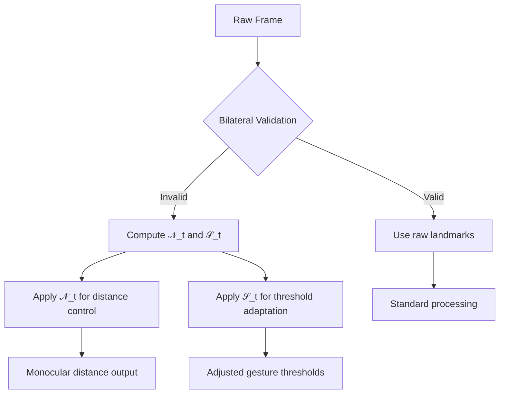

### Adaptive Normalization System for Monocular Distance & Range Adjustment

#### 1. Normalized Deformation Value (Middle Point Convergence)
Instead of rejecting asymmetric frames, we compute a normalized deformation value:

$$
\mathcal{N}_t = \frac{1}{2} \left[ \underbrace{\frac{\text{diag}(\mathcal{B}_t)}{\text{diag}(\mathcal{B}_{\text{base}})}_{\text{Scale component}} + \underbrace{\mathcal{S}(\mathbf{L}_t)}_{\text{Symmetry component}} \right]
$$

Where:
- $\text{diag}(\mathcal{B}) = \sqrt{w^2 + h^2}$ (bounding box diagonal)
- $\mathcal{S}(\mathbf{L}_t)$ is the symmetry preservation factor:

$$
\mathcal{S}(\mathbf{L}_t) = 1 - \min\left(1, \frac{1}{N}\sum_{k=1}^{N} \sigma_{ij}^{(k)}\right)
$$

#### 2. Dynamic Range Adjustment Factor
For adaptive threshold scaling based on hand distance:

$$
\mathcal{R}_t = \frac{\|\mathcal{B}_{\text{base}}\|}{\|\mathcal{B}_t\|} \cdot \Gamma_t
$$

With distance-adaptive correction:
$$
\Gamma_t = 1 + \frac{1}{2}\left(\tanh\left(\frac{\|\mathcal{B}_t\| - \mu_\mathcal{B}}{2\sigma_\mathcal{B}}\right) - \tanh\left(\frac{\|\mathcal{B}_{\text{base}}\| - \mu_\mathcal{B}}{2\sigma_\mathcal{B}}\right)\right)
$$

#### 3. Integrated Processing Algorithm

```math
\begin{aligned}
&\textbf{Algorithm: Adaptive Normalization} \\
&\textbf{Input: } \mathcal{B}_t, \mathbf{L}_t, \mathcal{B}_{\text{base}}, \mu_\mathcal{B}, \sigma_\mathcal{B} \\
&\textbf{Output: } \mathcal{N}_t, \mathcal{R}_t \\
&1.\ \text{Compute bounding box diagonal: } d_t = \sqrt{w_t^2 + h_t^2} \\
&2.\ \text{Calculate symmetry preservation:} \\
&\quad \sigma_{\text{avg}} = \frac{1}{3}\sum_{(i,j)\in P} \sigma_{ij} \\
&\quad \mathcal{S}_t = 1 - \min(1, \sigma_{\text{avg}}) \\
&3.\ \text{Compute normalized deformation:} \\
&\quad \mathcal{N}_t = \frac{1}{2}\left( \frac{d_t}{d_{\text{base}}} + \mathcal{S}_t \right) \\
&4.\ \text{Calculate range adjustment:} \\
&\quad \Gamma_t = 1 + \frac{1}{2}\left( \tanh\left(\frac{d_t - \mu_\mathcal{B}}{2\sigma_\mathcal{B}}\right) - \tanh\left(\frac{d_{\text{base}} - \mu_\mathcal{B}}{2\sigma_\mathcal{B}}\right) \right) \\
&\quad \mathcal{R}_t = \frac{d_{\text{base}}}{d_t} \cdot \Gamma_t \\
&5.\ \text{Update statistics:} \\
&\quad \mu_\mathcal{B} \leftarrow \alpha\mu_\mathcal{B} + (1-\alpha)d_t \\
&\quad \sigma_\mathcal{B} \leftarrow \beta\sigma_\mathcal{B} + (1-\beta)|d_t - \mu_\mathcal{B}| \\
&6.\ \textbf{return } \mathcal{N}_t, \mathcal{R}_t
\end{aligned}
```

#### 4. Threshold Adaptation for Gestures
For any range-based control with threshold $\tau$:

$$\tau_{\text{adapted}} = \tau \cdot \mathcal{R}_t \cdot (1 + k(1 - \mathcal{S}_t))$$

Where $k$ is asymmetry compensation factor (default 0.2).

#### 5. Implementation Notes

1. **Initial Calibration**:
   ```python
   # During first 30 frames
   base_diag = np.median([np.linalg.norm([b.w, b.h]) for b in frames])
   mu_b = base_diag
   sigma_b = np.std([np.linalg.norm([b.w, b.h]) for b in frames])
   ```

2. **Asymmetry Compensation**:
   - $\mathcal{S}_t \approx 1$: Perfect symmetry (no compensation)
   - $\mathcal{S}_t \approx 0.8$: Mild asymmetry (20% threshold relaxation)
   - $\mathcal{S}_t \approx 0.6$: Significant asymmetry (40% threshold relaxation)

3. **Dynamic Range Behavior**:
   ```math
   \begin{array}{c|c|c}
   \text{Distance} & \mathcal{R}_t & \text{Effect} \\
   \hline
   \text{Very Close} & 0.6-0.8 & \text{Thresholds reduced 20-40\%} \\
   \text{Neutral} & 1.0 & \text{Baseline thresholds} \\
   \text{Very Far} & 1.3-1.6 & \text{Thresholds increased 30-60\%} \\
   \end{array}
   ```

#### 6. Integration with Existing Validation


### Key Advantages

1. **Zero Frame Rejection**:
   - All frames produce usable output through $\mathcal{N}_t$
   - Invalid frames still contribute to distance estimation

2. **Dynamic Range Compensation**:
   - Automatically adjusts thresholds for hand distance changes
   - Compensates for both size changes and asymmetry

3. **Stability Preservation**:
   - $\tanh$ function ensures smooth transitions
   - Moving statistics prevent sudden jumps

4. **Backward Compatibility**:
   - Maintains existing validation framework
   - Adds normalization layer without core logic changes

5. **Tunable Parameters**:
   ```math
   \begin{array}{c|c|c}
   \text{Parameter} & \text{Range} & \text{Effect} \\
   \hline
   \alpha & 0.8-0.95 & \text{Mean adaptation speed} \\
   \beta & 0.85-0.98 & \text{Variance adaptation speed} \\
   k & 0.1-0.3 & \text{Asymmetry compensation} \\
   \end{array}
   ```

This system transforms bilateral validation from a binary gatekeeper into a continuous normalization source, enabling graceful degradation during asymmetric hand configurations while dynamically adapting to distance changes. The $\mathcal{N}_t$ output provides the "middle point" normalization you requested, and $\mathcal{R}_t$ solves the range-scaling problem for distant/close hand positions.
