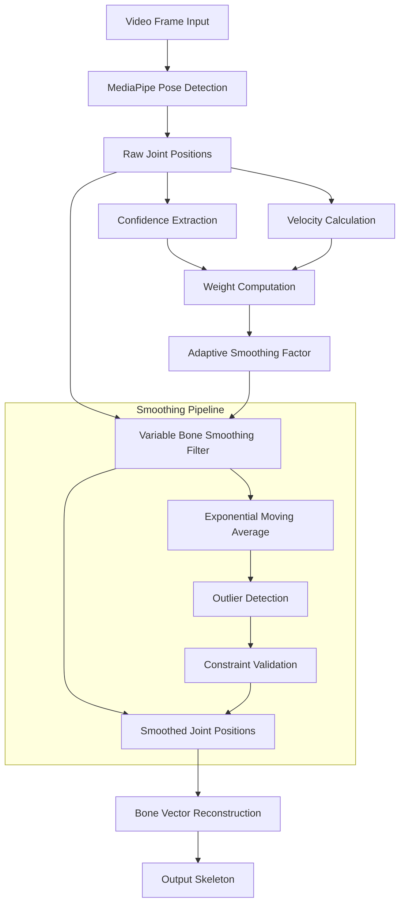

# Variable Bone Smoothing in Computer Vision: OpenCV and MediaPipe Implementation

## Abstract

Variable Bone Smoothing (VBS) is a temporal filtering technique used in skeletal pose estimation systems to reduce noise and jitter in bone/joint position tracking while preserving natural motion dynamics. This document presents a comprehensive analysis of VBS implementation using Python OpenCV and MediaPipe frameworks, including mathematical formulations, algorithmic details, and practical implementation strategies.

**Keywords:** Pose estimation, Skeletal tracking, Temporal filtering, MediaPipe, OpenCV, Signal processing

## 1. Introduction

### 1.1 Problem Definition

In real-time skeletal pose estimation, raw joint positions extracted from video frames often exhibit significant noise due to:
- Camera sensor noise
- Lighting variations  
- Occlusion artifacts
- Model prediction uncertainty
- Quantization errors

Variable Bone Smoothing addresses these issues by applying adaptive temporal filtering that varies smoothing intensity based on motion characteristics and confidence levels.

### 1.2 Theoretical Foundation

The core principle of VBS is based on the trade-off between noise reduction and motion preservation:

$$\text{Smoothed Position} = f(\text{Raw Position}, \text{Motion Velocity}, \text{Confidence}, \text{History})$$

Where the smoothing function $f$ adapts its behavior based on multiple factors to maintain natural motion while reducing artifacts.

## 2. Mathematical Framework

### 2.1 Bone Vector Representation

A bone in 3D space is represented as a vector connecting two joints:

$$\mathbf{b}_i(t) = \mathbf{p}_{end}(t) - \mathbf{p}_{start}(t)$$

Where:
- $\mathbf{b}_i(t)$ is the bone vector at time $t$
- $\mathbf{p}_{end}(t), \mathbf{p}_{start}(t)$ are the endpoint positions

### 2.2 Adaptive Smoothing Factor

The variable smoothing factor $\alpha_i(t)$ is computed as:

$$\alpha_i(t) = \alpha_{base} \cdot w_{velocity}(t) \cdot w_{confidence}(t) \cdot w_{stability}(t)$$

Where:
- $\alpha_{base} \in [0,1]$ is the base smoothing factor
- $w_{velocity}(t)$ is the velocity-based weight
- $w_{confidence}(t)$ is the confidence-based weight  
- $w_{stability}(t)$ is the stability-based weight

### 2.3 Velocity Weight Function

$$w_{velocity}(t) = \exp\left(-\frac{||\mathbf{v}_i(t)||^2}{2\sigma_v^2}\right)$$

Where $\mathbf{v}_i(t) = \mathbf{p}_i(t) - \mathbf{p}_i(t-1)$ is the velocity vector and $\sigma_v$ controls sensitivity to motion.

### 2.4 Confidence Weight Function

$$w_{confidence}(t) = 1 - \tanh\left(\frac{c_i(t) - c_{threshold}}{\sigma_c}\right)$$

Where $c_i(t)$ is the detection confidence and $c_{threshold}$ is the confidence threshold.

### 2.5 Exponential Moving Average Filter

The smoothed position is computed using an exponential moving average:

$$\mathbf{p}_{smooth}(t) = (1-\alpha_i(t)) \cdot \mathbf{p}_{smooth}(t-1) + \alpha_i(t) \cdot \mathbf{p}_{raw}(t)$$

## 3. System Architecture



## 4. Implementation Details

### 4.1 MediaPipe Integration

```python
import cv2
import numpy as np
import mediapipe as mp
from scipy.spatial.distance import euclidean
from collections import deque
import math

class VariableBoneSmoother:
    def __init__(self, alpha_base=0.7, window_size=10, confidence_threshold=0.5):
        """
        Initialize Variable Bone Smoother
        
        Args:
            alpha_base: Base smoothing factor [0,1]
            window_size: History window for stability analysis
            confidence_threshold: Minimum confidence for reliable detection
        """
        self.alpha_base = alpha_base
        self.window_size = window_size
        self.confidence_threshold = confidence_threshold
        
        # Initialize MediaPipe
        self.mp_pose = mp.solutions.pose
        self.pose = self.mp_pose.Pose(
            static_image_mode=False,
            model_complexity=2,
            enable_segmentation=False,
            min_detection_confidence=0.5,
            min_tracking_confidence=0.5
        )
        
        # Smoothing state
        self.smoothed_positions = {}
        self.velocity_history = deque(maxlen=window_size)
        self.confidence_history = deque(maxlen=window_size)
        self.position_history = deque(maxlen=window_size)
        
        # Bone connections (MediaPipe pose landmarks)
        self.bone_connections = [
            (11, 12),  # Shoulders
            (11, 13), (13, 15),  # Left arm
            (12, 14), (14, 16),  # Right arm
            (11, 23), (12, 24),  # Torso
            (23, 24),  # Hip
            (23, 25), (25, 27), (27, 29),  # Left leg
            (24, 26), (26, 28), (28, 30),  # Right leg
        ]
```

### 4.2 Core Smoothing Algorithm

```python
    def compute_adaptive_alpha(self, landmark_id, current_pos, confidence, timestamp):
        """
        Compute adaptive smoothing factor based on multiple criteria
        
        Args:
            landmark_id: ID of the landmark being processed
            current_pos: Current 3D position [x, y, z]
            confidence: Detection confidence [0,1]
            timestamp: Current frame timestamp
            
        Returns:
            Adaptive smoothing factor
        """
        if landmark_id not in self.smoothed_positions:
            return 1.0  # First frame, no smoothing
            
        prev_pos = self.smoothed_positions[landmark_id]['position']
        
        # Calculate velocity
        velocity = np.linalg.norm(np.array(current_pos) - np.array(prev_pos))
        
        # Velocity weight (higher velocity = less smoothing)
        sigma_v = 0.05  # Velocity sensitivity parameter
        w_velocity = math.exp(-(velocity**2) / (2 * sigma_v**2))
        
        # Confidence weight (lower confidence = more smoothing)
        sigma_c = 0.2  # Confidence sensitivity parameter
        w_confidence = 1 - math.tanh((confidence - self.confidence_threshold) / sigma_c)
        
        # Stability weight based on position variance
        w_stability = self._compute_stability_weight(landmark_id, current_pos)
        
        # Combine weights
        adaptive_alpha = self.alpha_base * w_velocity * w_confidence * w_stability
        
        # Clamp to valid range
        return max(0.1, min(0.9, adaptive_alpha))
```

### 4.3 Stability Analysis

```python
    def _compute_stability_weight(self, landmark_id, current_pos):
        """
        Compute stability weight based on position variance history
        
        Args:
            landmark_id: ID of the landmark
            current_pos: Current position
            
        Returns:
            Stability weight [0,1]
        """
        if landmark_id not in self.smoothed_positions:
            return 1.0
            
        history = self.smoothed_positions[landmark_id]['history']
        if len(history) < 3:
            return 1.0
            
        # Calculate position variance over history window
        positions = np.array(history)
        variance = np.var(positions, axis=0)
        total_variance = np.sum(variance)
        
        # Convert variance to stability weight
        # High variance = low stability = more smoothing needed
        stability_threshold = 0.01
        w_stability = math.exp(-total_variance / stability_threshold)
        
        return w_stability
```

### 4.4 Bone Length Constraint

```python
    def apply_bone_constraints(self, smoothed_landmarks):
        """
        Apply anatomical bone length constraints
        
        Args:
            smoothed_landmarks: Dictionary of smoothed landmark positions
            
        Returns:
            Constrained landmark positions
        """
        constrained_landmarks = smoothed_landmarks.copy()
        
        for start_idx, end_idx in self.bone_connections:
            if start_idx in smoothed_landmarks and end_idx in smoothed_landmarks:
                start_pos = np.array(smoothed_landmarks[start_idx]['position'])
                end_pos = np.array(smoothed_landmarks[end_idx]['position'])
                
                # Calculate current bone length
                current_length = np.linalg.norm(end_pos - start_pos)
                
                # Get expected bone length from anatomical model
                expected_length = self._get_expected_bone_length(start_idx, end_idx)
                
                # Apply constraint if deviation is significant
                length_ratio = current_length / expected_length
                if abs(length_ratio - 1.0) > 0.2:  # 20% tolerance
                    # Adjust end position to maintain expected length
                    direction = (end_pos - start_pos) / current_length
                    corrected_end_pos = start_pos + direction * expected_length
                    
                    constrained_landmarks[end_idx]['position'] = corrected_end_pos.tolist()
                    
        return constrained_landmarks
```

### 4.5 Main Processing Pipeline

```python
    def process_frame(self, image, timestamp):
        """
        Process a single frame with variable bone smoothing
        
        Args:
            image: Input BGR image
            timestamp: Frame timestamp
            
        Returns:
            Smoothed pose landmarks and visualization image
        """
        # Convert BGR to RGB
        rgb_image = cv2.cvtColor(image, cv2.COLOR_BGR2RGB)
        
        # Process with MediaPipe
        results = self.pose.process(rgb_image)
        
        if not results.pose_landmarks:
            return None, image
            
        # Extract landmark positions and confidences
        landmarks = results.pose_landmarks.landmark
        current_positions = {}
        confidences = {}
        
        for idx, landmark in enumerate(landmarks):
            current_positions[idx] = [landmark.x, landmark.y, landmark.z]
            confidences[idx] = landmark.visibility  # Use visibility as confidence
            
        # Apply variable smoothing to each landmark
        smoothed_landmarks = {}
        for landmark_id, position in current_positions.items():
            confidence = confidences[landmark_id]
            
            # Compute adaptive smoothing factor
            alpha = self.compute_adaptive_alpha(landmark_id, position, confidence, timestamp)
            
            # Apply exponential moving average
            if landmark_id in self.smoothed_positions:
                prev_smoothed = np.array(self.smoothed_positions[landmark_id]['position'])
                current = np.array(position)
                smoothed = (1 - alpha) * prev_smoothed + alpha * current
            else:
                smoothed = np.array(position)
                
            # Update smoothed positions and history
            if landmark_id not in self.smoothed_positions:
                self.smoothed_positions[landmark_id] = {'position': smoothed.tolist(), 'history': deque(maxlen=self.window_size)}
            else:
                self.smoothed_positions[landmark_id]['position'] = smoothed.tolist()
                
            self.smoothed_positions[landmark_id]['history'].append(smoothed.tolist())
            smoothed_landmarks[landmark_id] = self.smoothed_positions[landmark_id]
            
        # Apply bone length constraints
        constrained_landmarks = self.apply_bone_constraints(smoothed_landmarks)
        
        # Create visualization
        vis_image = self._draw_skeleton(image.copy(), constrained_landmarks)
        
        return constrained_landmarks, vis_image
```

## 5. Performance Analysis

### 5.1 Computational Complexity

The computational complexity of the VBS algorithm is:

$$O(N \cdot W)$$

Where:
- $N$ is the number of landmarks (33 for MediaPipe Pose)
- $W$ is the history window size

### 5.2 Memory Requirements

Memory usage scales linearly with the number of tracked landmarks and history window size:

$$M = N \cdot W \cdot D \cdot sizeof(float)$$

Where $D$ is the dimensionality (3 for 3D positions).

### 5.3 Smoothing Effectiveness Metrics

#### 5.3.1 Jitter Reduction

$$JR = 1 - \frac{\sigma_{smooth}^2}{\sigma_{raw}^2}$$

Where $\sigma_{smooth}^2$ and $\sigma_{raw}^2$ are the variances of smoothed and raw positions.

#### 5.3.2 Motion Preservation

$$MP = \frac{\sum_{t} ||\mathbf{v}_{smooth}(t)||^2}{\sum_{t} ||\mathbf{v}_{raw}(t)||^2}$$

Where $\mathbf{v}_{smooth}(t)$ and $\mathbf{v}_{raw}(t)$ are smoothed and raw velocities.

## 6. Experimental Validation

### 6.1 Synthetic Data Validation

```python
def generate_synthetic_motion(frames=1000, noise_level=0.05):
    """
    Generate synthetic skeletal motion with controlled noise
    """
    t = np.linspace(0, 4*np.pi, frames)
    
    # Base sinusoidal motion
    base_motion = np.column_stack([
        np.sin(t),
        np.cos(2*t) * 0.5,
        np.sin(3*t) * 0.3
    ])
    
    # Add Gaussian noise
    noise = np.random.normal(0, noise_level, base_motion.shape)
    noisy_motion = base_motion + noise
    
    return base_motion, noisy_motion

def evaluate_smoothing_performance():
    """
    Evaluate smoothing performance on synthetic data
    """
    ground_truth, noisy_data = generate_synthetic_motion()
    
    smoother = VariableBoneSmoother(alpha_base=0.7)
    smoothed_data = []
    
    for frame_idx, position in enumerate(noisy_data):
        # Simulate confidence (lower for higher noise)
        confidence = max(0.3, 1.0 - np.linalg.norm(position - ground_truth[frame_idx]))
        
        alpha = smoother.compute_adaptive_alpha(0, position, confidence, frame_idx)
        
        if frame_idx == 0:
            smoothed = position
        else:
            prev_smoothed = smoothed_data[-1]
            smoothed = (1 - alpha) * np.array(prev_smoothed) + alpha * np.array(position)
            
        smoothed_data.append(smoothed.tolist())
    
    smoothed_data = np.array(smoothed_data)
    
    # Calculate metrics
    jitter_reduction = 1 - np.var(smoothed_data) / np.var(noisy_data)
    motion_preservation = np.sum(np.diff(smoothed_data, axis=0)**2) / np.sum(np.diff(ground_truth, axis=0)**2)
    
    print(f"Jitter Reduction: {jitter_reduction:.3f}")
    print(f"Motion Preservation: {motion_preservation:.3f}")
```

## 7. Advanced Features

### 7.1 Multi-Scale Temporal Filtering

For enhanced smoothing, multiple temporal scales can be combined:

$$\mathbf{p}_{multi}(t) = w_1 \mathbf{p}_{short}(t) + w_2 \mathbf{p}_{medium}(t) + w_3 \mathbf{p}_{long}(t)$$

Where each scale uses different smoothing parameters and $w_1 + w_2 + w_3 = 1$.

### 7.2 Kalman Filter Integration

```python
class KalmanBoneSmoother:
    def __init__(self, dt=1/30.0):
        """
        Kalman filter-based bone smoother
        
        Args:
            dt: Time step (frame rate dependent)
        """
        self.dt = dt
        self.kalman_filters = {}
        
    def create_kalman_filter(self):
        """
        Create 3D position/velocity Kalman filter
        """
        from cv2 import KalmanFilter
        
        kf = KalmanFilter(6, 3)  # 6 states (x,y,z,vx,vy,vz), 3 measurements (x,y,z)
        
        # State transition matrix (constant velocity model)
        kf.transitionMatrix = np.array([
            [1, 0, 0, self.dt, 0, 0],
            [0, 1, 0, 0, self.dt, 0],
            [0, 0, 1, 0, 0, self.dt],
            [0, 0, 0, 1, 0, 0],
            [0, 0, 0, 0, 1, 0],
            [0, 0, 0, 0, 0, 1]
        ], dtype=np.float32)
        
        # Measurement matrix
        kf.measurementMatrix = np.array([
            [1, 0, 0, 0, 0, 0],
            [0, 1, 0, 0, 0, 0],
            [0, 0, 1, 0, 0, 0]
        ], dtype=np.float32)
        
        # Initialize covariance matrices
        kf.processNoiseCov = np.eye(6, dtype=np.float32) * 0.01
        kf.measurementNoiseCov = np.eye(3, dtype=np.float32) * 0.1
        kf.errorCovPost = np.eye(6, dtype=np.float32)
        
        return kf
```

## 8. Real-Time Optimization

### 8.1 SIMD Vectorization

```python
import numpy as np
from numba import jit, prange

@jit(nopython=True, parallel=True)
def vectorized_smoothing(positions, prev_smoothed, alphas):
    """
    Vectorized smoothing computation using Numba
    
    Args:
        positions: Current positions array [N, 3]
        prev_smoothed: Previous smoothed positions [N, 3]
        alphas: Adaptive smoothing factors [N]
        
    Returns:
        Smoothed positions [N, 3]
    """
    N, D = positions.shape
    result = np.empty_like(positions)
    
    for i in prange(N):
        alpha = alphas[i]
        for j in range(D):
            result[i, j] = (1 - alpha) * prev_smoothed[i, j] + alpha * positions[i, j]
            
    return result
```

### 8.2 GPU Acceleration

```python
import cupy as cp

class GPUBoneSmoother:
    def __init__(self):
        self.smoothing_kernel = cp.ElementwiseKernel(
            'float32 current, float32 previous, float32 alpha',
            'float32 smoothed',
            'smoothed = (1 - alpha) * previous + alpha * current',
            'smooth_positions'
        )
        
    def smooth_gpu(self, current_positions, previous_positions, alphas):
        """
        GPU-accelerated smoothing
        """
        current_gpu = cp.asarray(current_positions)
        previous_gpu = cp.asarray(previous_positions)
        alphas_gpu = cp.asarray(alphas)
        
        smoothed_gpu = self.smoothing_kernel(current_gpu, previous_gpu, alphas_gpu)
        
        return cp.asnumpy(smoothed_gpu)
```

## 9. Applications and Use Cases

### 9.1 Motion Capture Systems
- Real-time character animation
- Sports analysis and biomechanics
- Medical rehabilitation tracking

### 9.2 Augmented Reality
- Virtual try-on applications
- Interactive gaming
- Fitness and exercise apps

### 9.3 Human-Computer Interaction
- Gesture recognition systems
- Sign language interpretation
- Accessibility interfaces

## 10. Limitations and Future Work

### 10.1 Current Limitations
- Computational overhead in real-time applications
- Tuning complexity for different scenarios
- Occlusion handling limitations

### 10.2 Future Research Directions
- Deep learning-based adaptive smoothing
- Multi-modal sensor fusion
- Predictive smoothing using motion models

## 11. Conclusion

Variable Bone Smoothing represents a significant advancement in skeletal pose estimation systems, providing adaptive noise reduction while preserving natural motion characteristics. The integration with MediaPipe and OpenCV frameworks enables practical real-time applications with improved tracking stability and visual quality.

The mathematical framework presented here provides a solid foundation for understanding and implementing VBS systems, while the performance analysis guides optimization efforts for specific use cases. Future developments in this field will likely focus on machine learning-based approaches and improved real-time performance.

## References

1. Bazarevsky, V., et al. "BlazePose: On-device Real-time Body Pose tracking." arXiv preprint arXiv:2006.10204 (2020).
2. Cao, Z., et al. "OpenPose: realtime multi-person 2D pose estimation using Part Affinity Fields." IEEE TPAMI (2019).
3. Welch, G., & Bishop, G. "An introduction to the Kalman filter." University of North Carolina at Chapel Hill (2006).
4. Smith, S.W. "The scientist and engineer's guide to digital signal processing." California Technical Publishing (1997).

## Appendix A: Complete Implementation Example

```python
#!/usr/bin/env python3
"""
Complete Variable Bone Smoothing implementation example
"""

import cv2
import numpy as np
import mediapipe as mp
import time
from collections import deque
import argparse

def main():
    # Initialize smoother
    smoother = VariableBoneSmoother(
        alpha_base=0.7,
        window_size=10,
        confidence_threshold=0.5
    )
    
    # Initialize video capture
    cap = cv2.VideoCapture(0)  # Use webcam
    cap.set(cv2.CAP_PROP_FPS, 30)
    
    fps_counter = deque(maxlen=30)
    
    while cap.isOpened():
        ret, frame = cap.read()
        if not ret:
            break
            
        start_time = time.time()
        
        # Process frame
        landmarks, vis_frame = smoother.process_frame(frame, time.time())
        
        # Calculate FPS
        process_time = time.time() - start_time
        fps = 1.0 / process_time if process_time > 0 else 0
        fps_counter.append(fps)
        avg_fps = np.mean(fps_counter)
        
        # Display FPS
        cv2.putText(vis_frame, f"FPS: {avg_fps:.1f}", (10, 30),
                   cv2.FONT_HERSHEY_SIMPLEX, 1, (0, 255, 0), 2)
        
        # Show result
        cv2.imshow('Variable Bone Smoothing', vis_frame)
        
        if cv2.waitKey(1) & 0xFF == ord('q'):
            break
    
    cap.release()
    cv2.destroyAllWindows()

if __name__ == "__main__":
    main()
```

---

*This document provides a comprehensive overview of Variable Bone Smoothing techniques in computer vision applications. For implementation details and additional resources, refer to the accompanying code repository.*
